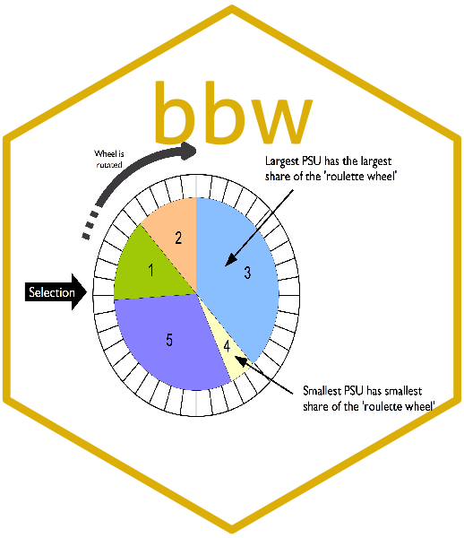

<!-- README.md is generated from README.Rmd. Please edit that file -->

# bbw: Blocked Weighted Bootstrap 

<!-- badges: start -->

[](https://www.repostatus.org/#active)
[](https://www.tidyverse.org/lifecycle/#maturing)
[](https://cran.r-project.org/package=bbw)
[](https://CRAN.R-project.org/package=bbw)
[](https://CRAN.R-project.org/package=bbw)
[](https://CRAN.R-project.org/package=bbw)
[](https://travis-ci.org/rapidsurveys/bbw)
[](https://ci.appveyor.com/project/rapidsurveys/bbw/branch/master)

[](https://codecov.io/gh/rapidsurveys/bbw?branch=master)

[](https://www.codefactor.io/repository/github/rapidsurveys/bbw)
<!-- badges: end -->

## Overview

The **blocked weighted bootstrap** is an estimation technique for use
with data from two-stage cluster sampled surveys in which either prior
weighting (e.g. *population-proportional sampling* or *PPS* as used in
**Standardized Monitoring and Assessment of Relief and Transitions** or
**SMART** surveys) or *posterior weighting* (e.g. as used in **Rapid
Assessment Method** or **RAM** and **Simple Spatial Sampling Method** or
**S3M** surveys) is implemented.

## Installation

You can install `bbw` from CRAN with:

``` r
install.packages("bbw")
```

You can install the current development version of `bbw` from GitHub via
the `remotes` package with:

``` r
if(!require(remotes)) install.packages("remotes")
remotes::install_github("rapidsurveys/bbw")
```

## Usage

`bbw` as used in **RAM** and **S3M** is a modification to the
*percentile bootstrap* to include *blocking* and *weighting* to account
for a *complex sample design*.

With **RAM** and **S3M** surveys, the sample is complex in the sense
that it is an unweighted cluster sample. Data analysis procedures need
to account for the sample design. A **blocked weighted bootstrap** can
be used:

<br/>

**Blocked**: The block corresponds to the primary sampling unit (*PSU =
cluster*). *PSU*s are resampled with replacement. Observations within
the resampled *PSU*s are also sampled with replacement.

**Weighted**: **RAM** and **S3M** samples do not use *population
proportional sampling (PPS)* to weight the sample prior to data
collection (e.g. as is done with **SMART** surveys). This means that a
posterior weighting procedure is required. `bbw` uses a *“roulette
wheel”* algorithm (see [illustration below](#FIG1)) to weight (i.e. by
population) the selection probability of *PSU*s in bootstrap replicates.

<p align="center">


</p>

In the case of prior weighting by *PPS* all clusters are given the same
weight. With posterior weighting (as in **RAM** or **S3M**) the weight
is the population of each *PSU*. This procedure is very similar to the
*fitness proportional selection* technique used in *evolutionary
computing*.

A total of *m* *PSU*s are sampled with replacement for each bootstrap
replicate (where *m* is the number of *PSU*s in the survey sample).

The required statistic is applied to each replicate. The reported
estimate consists of the 0.025th (*95% LCL*), 0.5th (*point estimate*),
and 0.975th (*95% UCL*) quantiles of the distribution of the statistic
across all survey replicates.

The main reason to use `bbw` is that the bootstrap allows a wider range
statistics to be calculated than model-based techniques without resort
to grand assumptions about the sampling distribution of the required
statistic. A good example for this is the confidence interval on the
difference between two medians which might be used for many
socio-economic variables. The `bbw` also allows for a wider range of
hypothesis tests to be used with complex sample survey data.
